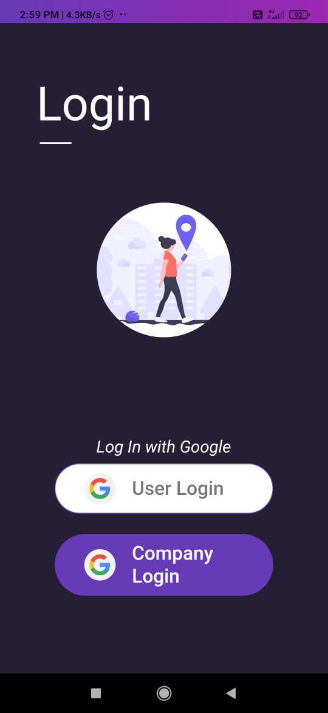

# Yujai

**Yujai** helps you connect with professionals, business owners, startup entrepreneurs, and passionate individuals. It empowers you to gain experience, earn income, and work remotely, fostering professional growth and economic development.

> **India's First Reliable Professional Network:** Enhancing job quality, filtering potential job seekers, and driving economic growth across every industry.

---

## 🚀 **Key Features**

### **1. Profile**
- Acts as your **digital resume**.
- Keeps your professional status transparent.
- Helps associates connect with you easily.

### **2. Job Application**
- Enables **professionals and freelancers** to create compelling job applications.
- Simplifies the process for companies or contractors to find and connect with talent.

### **3. Group**
- Create committees for mutual benefit.
- Start discussions, share knowledge, and seek help.
- Enable eCommerce functionality to buy/sell products.
- Daily updates and events by group leaders.

### **4. Job Search**
- Connect with recruiters and build professional networks.
- Explore job opportunities at top employers.
- 80% of employers utilize social media for recruitment.

### **5. Event Management**
- Promote company events, from product launches to seminars.
- Keep organizational updates transparent and accessible.

### **6. Articles**
- Share and publish engaging articles.
- Integrate weblinks for cross-platform promotion.
- Drive traffic to your website.

### **7. Online Collaboration**
- Utilize virtual collaboration tools.
- Enable seamless remote teamwork.
- Suitable for organizations of all sizes.

---

## 🖥️ **Screenshots**

---

## 📲 **Get Started**
1. Download the app.
2. Create your professional profile.
3. Start exploring opportunities and connecting with professionals.

---

## 📄 **License**
This project is licensed under the [MIT License](LICENSE).

---

**Connect, Collaborate, and Grow with Yujai! 🌟**

---

For more details, visit our official website: [Yujai Official Site](#)

---

**Happy Networking! 👥**

---

**Created by Animus IT Management**

---
